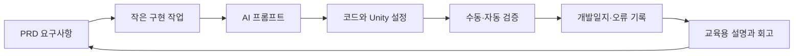

# Project Tiny Vanguard

> 작은 전투 게임 하나를 끝까지 만들며, AI와 협업하는 소프트웨어 개발 과정을 수업 가능한 형태로 기록한다.

## 바로가기

- 제품 정의: [[01_PRD]]
- 일정과 마일스톤: [[02_ROADMAP]]
- 기록·검증 절차: [[03_VIBE_CODING_WORKFLOW]]
- 교육과정 구성: [[04_CURRICULUM_MAP]]
- 기술 환경 기준선: [[05_TECHNICAL_BASELINE]]
- Git·대형 에셋 정책: [[06_ASSET_AND_GIT_POLICY]]
- 입력 액션 계약: [[07_INPUT_ACTIONS]]
- 플레이어 이동 계약: [[08_PLAYER_MOVEMENT]]
- 3인칭 카메라 계약: [[09_THIRD_PERSON_CAMERA]]
- 카메라 장애물 가림 처리: [[10_CAMERA_OCCLUSION]]
- 게임플레이 입력 차단: [[11_GAMEPLAY_INPUT_GATING]]
- 플레이어 회피·무적: [[12_PLAYER_DODGE]]
- M1 플레이어 조작 통합 실습: [[13_M1_PLAYER_CONTROL_LAB]]
- 체력·피해·사망 규칙: [[14_HEALTH_DAMAGE_DEATH]]
- Actor·Attack 정의 데이터: [[15_COMBAT_DEFINITIONS]]
- 기본 공격 애니메이션·판정 창: [[16_ATTACK_ANIMATION_WINDOW]]
- 공격 실행별 단일 타격: [[17_ATTACK_EXECUTION]]
- 피격·사망·피해 출력 이벤트: [[18_COMBAT_FEEDBACK_EVENTS]]
- 공격 애니메이션·피해 타이밍 측정: [[19_ATTACK_TIMING_MEASUREMENT]]
- 일반 적 정의 데이터: [[20_ENEMY_DEFINITION]]
- 일반 적 상태 머신: [[21_ENEMY_STATE_MACHINE]]
- 적 NavMesh 베이크·이동: [[22_ENEMY_NAVIGATION]]
- 적 탐지·추적·공격 쿨다운: [[23_ENEMY_DETECTION_COMBAT]]
- 적 이탈·홈 복귀: [[24_ENEMY_RETURN_HOME]]
- 적 사망 행동·보상 차단: [[25_ENEMY_DEATH_GUARD]]
- 다섯 적 접근 슬롯·공간 분리: [[26_ENEMY_SPATIAL_SEPARATION]]
- M3 적 AI 검증 매트릭스: [[27_M3_ENEMY_AI_VALIDATION]]
- 구현 명세: [OpenSpec change](../openspec/changes/build-action-rpg-vertical-slice/proposal.md)
- 구현 작업: [OpenSpec tasks](../openspec/changes/build-action-rpg-vertical-slice/tasks.md)
- 기술 결정: [[Decisions/ADR-0001-documentation-source-of-truth]]
- 개발일지 템플릿: [[Templates/DEVLOG_TEMPLATE]]
- 프롬프트 기록 템플릿: [[Templates/PROMPT_LOG_TEMPLATE]]
- 오류 해결 템플릿: [[Templates/TROUBLESHOOTING_TEMPLATE]]
- 기능 완료 체크리스트: [[Templates/FEATURE_DONE_CHECKLIST]]

## 프로젝트 한눈에 보기

| 항목 | 내용 |
|---|---|
| 장르 | 3인칭 로우폴리 액션 RPG |
| 결과물 | 10~15분 분량의 전투 버티컬 슬라이스 |
| 핵심 재미 | 회피·기본 공격·스킬을 조합해 다수의 적과 보스를 처치 |
| 1차 플랫폼 | macOS Apple Silicon |
| 2차 검증 | Windows 11 |
| 엔진 | Unity 6 + URP |
| 개발 방식 | PRD 기반의 작은 기능 단위 바이브코딩 |
| 교육 대상 | Unity 기초와 C# 기본 문법을 배운 학습자 |
| 명세 도구 | OpenSpec CLI 1.5.0 |

## 문서 흐름

## 완료의 의미

이 프로젝트에서 “완료”는 코드가 생성된 상태가 아니다. 다음 항목이 모두 충족되어야 한다.

1. PRD의 인수 기준을 플레이 모드에서 재현할 수 있다.
2. 관련 코드와 Unity 설정이 버전 관리 대상에 포함된다.
3. 검증 방법과 결과가 개발일지에 남아 있다.
4. 사용한 프롬프트와 AI 결과에 대한 사람의 판단이 기록되어 있다.
5. 학습자가 같은 기능을 다시 만들 수 있는 설명이 있다.
