# Cinemachine 3인칭 카메라 계약

이 문서는 OpenSpec 작업 2.3에서 구현한 플레이어 추적, 마우스 궤도 회전, 감도와 상하 각도 제한을 설명한다.

## 범위

### 포함

- `CinemachineBrain`을 통한 Main Camera 출력
- `CinemachineCamera`의 플레이어 추적·주시 대상 연결
- `CinemachineOrbitalFollow`의 구면 궤도
- `Gameplay/Look` 마우스 델타 기반 수평·수직 회전
- Inspector에서 조절 가능한 X/Y 감도
- 수평 각도 순환과 수직 각도 제한
- 플레이 중 커서 잠금과 포커스 해제 시 복구
- `CinemachineDeoccluder` 기반 장애물 가림 처리
- 샌드박스 자동 구성 및 EditMode·PlayMode 회귀 테스트

### 제외

- 게임 상태별 Gameplay/UI 입력 맵 전환: 작업 2.5
- 조준 모드, 락온, 화면 흔들림과 줌: 후속 전투·폴리싱 작업

FR-CAMERA-001의 플레이어 추적과 장애물 가림 최소화는 [[10_CAMERA_OCCLUSION]]까지 연결해 충족한다.

## 플레이 입력에서 화면 출력까지

```mermaid
flowchart LR
    A["Mouse Delta"] --> B["Gameplay/Look"]
    B --> C["ThirdPersonCameraController"]
    C --> D["CameraOrbitMath"]
    D --> E["Horizontal / Vertical Axis"]
    E --> F["CinemachineOrbitalFollow"]
    F --> G["CinemachineCamera"]
    G --> H["CinemachineBrain"]
    H --> I["Main Camera 출력"]
```



`ThirdPersonCameraController`는 Unity 생명주기와 입력을 담당한다. `CameraOrbitMath`는 Unity 씬 상태와 분리된 순수 계산이라 입력 예시만으로 빠르게 검증할 수 있다.

## Cinemachine 구성요소의 책임

| 구성요소 | 배치 | 책임 |
|---|---|---|
| `CinemachineBrain` | Main Camera | 가장 우선순위가 높은 가상 카메라 상태를 실제 화면에 출력 |
| `CinemachineCamera` | Third Person Camera | Follow와 LookAt 대상을 `Camera Target`으로 지정 |
| `CinemachineOrbitalFollow` | Third Person Camera | 대상에서 일정 거리의 구면 궤도 위치 계산 |
| `CinemachineRotationComposer` | Third Person Camera | 카메라가 대상을 계속 바라보도록 회전 구성 |
| `CinemachineDeoccluder` | Third Person Camera | 벽·기둥이 시야를 막으면 카메라 최종 위치 보정 |
| `ThirdPersonCameraController` | Third Person Camera | Look 입력을 감도·제한이 적용된 Cinemachine 축 값으로 변환 |
| `Camera Target` | Player 자식 | 캐릭터 발이 아닌 상체 높이를 추적·주시하는 기준점 |

Main Camera를 플레이어의 자식으로 만들지 않는다. 실제 카메라 위치는 Cinemachine이 계산하고, 플레이어에는 높이 기준점만 둔다.

## CombatSandbox 계층

```text
CombatSandbox
├── Main Camera
│   └── CinemachineBrain
├── Player
│   ├── Visual
│   ├── Facing Marker
│   └── Camera Target (local Y = 1.4)
├── Third Person Camera
    ├── CinemachineCamera
    ├── CinemachineOrbitalFollow
    ├── CinemachineRotationComposer
    ├── CinemachineDeoccluder
    └── ThirdPersonCameraController
└── Camera Occlusion Cases
    ├── Direct Occlusion Wall
    ├── Side Occlusion Pillar
    └── Diagonal Occlusion Block
```

## 기본 조정값

| 항목 | 값 | 단위·의미 |
|---|---:|---|
| Orbit Style | Sphere | 고정 반지름의 구면 궤도 |
| Radius | 6 | Camera Target과 카메라 사이 거리 |
| Initial Horizontal | 0° | 플레이어 뒤쪽에서 시작 |
| Initial Vertical | 20° | 캐릭터를 약간 내려다보는 시작 각도 |
| Horizontal Sensitivity | 0.12 | 마우스 1픽셀당 수평 회전 각도 |
| Vertical Sensitivity | 0.08 | 마우스 1픽셀당 수직 회전 각도 |
| Vertical Minimum | -20° | 아래쪽 궤도 하한 |
| Vertical Maximum | 65° | 위쪽 궤도 상한 |
| Composer Damping | 0.15, 0.15 | 주시 회전의 수평·수직 지연 |
| Cursor Lock | On | 포커스 중 포인터 이탈 방지 |
| Deoccluder Radius | 0.25m | 벽 표면과 카메라 사이 여유 |
| Deoccluder Return Damping | 0.05 | 장애물 제거 후 궤도 복귀 감쇠 |

이 값은 최종 밸런스가 아니라 조작 검증용 기준선이다. 에셋의 실제 신장, 경기장 크기와 전투 속도가 정해지면 다시 조정한다.

## 회전 계산 규칙

```text
horizontal = Wrap180(currentHorizontal + mouseDeltaX × sensitivityX)
vertical   = Clamp(
               currentVertical + mouseDeltaY × sensitivityY,
               minimumVertical,
               maximumVertical)
```

수평 축은 계속 돌 수 있으므로 -180°에서 180° 사이를 순환한다. 수직 축은 캐릭터 아래나 정수리 너머로 뒤집히지 않도록 -20°에서 65° 사이에서 멈춘다.

### 마우스 델타에 deltaTime을 다시 곱하지 않는 이유

`<Pointer>/delta`는 직전 입력 갱신 이후 포인터가 이동한 픽셀량이다. 이미 한 갱신 구간의 변화량이므로 여기에 `deltaTime`을 다시 곱하면 같은 물리적 마우스 이동도 프레임레이트에 따라 회전량이 달라진다. 이 카메라는 픽셀당 각도로 감도를 해석한다.

키보드나 스틱처럼 “누르고 있는 동안의 속도”를 읽는 입력은 초당 회전 속도와 `deltaTime`이 필요할 수 있다. 입력 값의 의미부터 확인한 뒤 시간 보정을 결정해야 한다.

## 입력 맵 생명주기

현재 M1 샌드박스에서는 `PlayerMovementController`가 Gameplay 맵의 기본 생명주기를 관리하고, 카메라 Controller도 활성화 시 Gameplay 맵이 켜져 있음을 보장한다. 카메라가 비활성화될 때 공유 맵을 임의로 끄지 않아 이동 입력까지 중단되는 경쟁을 피한다.

게임 상태에 따른 Gameplay·UI 전환과 단일 소유권은 작업 2.5에서 중앙 입력 상태 관리자로 통합한다.

## 자동 구성 절차

Unity 메뉴에서 다음 항목을 실행할 수 있다.

```text
Tiny Vanguard > Setup Third Person Camera Sandbox
```

이 도구는 다음 순서로 동작한다.

1. `CombatSandbox`와 `TinyVanguardInput`을 불러온다.
2. Player 아래에 `Camera Target`을 만들거나 기존 대상을 재사용한다.
3. Main Camera에 `CinemachineBrain`이 없으면 추가한다.
4. 기존 `Third Person Camera`를 교체해 중복 카메라를 방지한다.
5. Follow, LookAt, 궤도 반지름, 시작 각도와 제한을 설정한다.
6. Input Actions와 Controller 참조를 연결한다.
7. 필수 구성과 값이 맞는지 검사한 뒤 씬을 저장한다.

`Setup Player Movement Sandbox`를 다시 실행해 Player가 재생성되어도 마지막 단계에서 카메라 자동 구성을 함께 호출하므로 Follow 참조가 끊어지지 않는다.

## 자동 검증

### EditMode

`CameraOrbitMathTests`는 다음 여섯 조건을 검증한다.

- X/Y 감도가 독립적으로 적용됨
- 수직 상한에서 정확히 제한됨
- 수직 하한에서 정확히 제한됨
- 수평 180° 경계를 넘어가면 반대편으로 순환함
- 잘못 뒤집힌 상하 제한 입력을 정규화함
- 음수 감도가 의도하지 않은 축 반전을 만들지 않음

기존 회귀 검사를 포함한 전체 EditMode 결과는 **19/19 passed**이다.

### PlayMode

`ThirdPersonCameraPlayModeTests`는 실제 `CombatSandbox`를 불러와 다음을 검증한다.

1. Main Camera에 Brain이 있고 가상 카메라 파이프라인이 모두 존재한다.
2. Follow와 LookAt이 Player의 `Camera Target`을 참조한다.
3. 가상 마우스 델타 X=100이 감도 0.12를 거쳐 수평 12°가 된다.
4. 큰 수직 입력이 65° 상한에서 멈춘다.
5. Player를 이동하면 감쇠를 거쳐 실제 Main Camera도 추적 이동한다.

장애물 가림 테스트를 포함한 전체 PlayMode 결과는 **7/7 passed**이다.

## 수동 확인 시나리오

1. `CombatSandbox` 씬을 열고 Play를 누른다.
2. 마우스를 좌우로 움직여 플레이어 주위를 연속 회전하는지 확인한다.
3. 마우스를 위아래로 크게 움직여도 카메라가 캐릭터 아래나 정수리 너머로 뒤집히지 않는지 확인한다.
4. W를 누르면 현재 카메라가 보는 수평 방향으로 플레이어가 이동하는지 확인한다.
5. 이동 중 마우스를 회전해 W 진행 방향이 새 카메라 방향을 따라 바뀌는지 확인한다.
6. Game 뷰에서 포커스를 빼고 Play를 종료해 커서가 정상 복구되는지 확인한다.

정면 벽, 측면 기둥과 대각선 블록의 상세 수동 검증은 [[10_CAMERA_OCCLUSION]]을 따른다.

## 조정 순서

카메라 감각을 바꿀 때는 한 번에 한 종류의 값만 조정한다.

1. Radius로 화면에서 캐릭터 크기를 정한다.
2. Camera Target Y로 시선 기준 높이를 정한다.
3. Vertical Minimum·Maximum으로 허용 구도를 정한다.
4. X/Y Sensitivity로 조작량을 정한다.
5. Composer Damping으로 추적의 즉각성만 조정한다.
6. 마지막으로 작업 2.4의 충돌 반응을 조정한다.

반지름, 감도, 감쇠를 동시에 바꾸면 어떤 값이 조작감을 개선하거나 악화했는지 설명하기 어렵다.

## 흔한 오류와 진단

| 증상 | 우선 확인할 항목 |
|---|---|
| Main Camera가 움직이지 않음 | Main Camera의 `CinemachineBrain`, 활성 가상 카메라 |
| 화면이 원점만 바라봄 | Follow·LookAt과 `Camera Target` 참조 |
| 위아래로 화면이 뒤집힘 | Vertical Axis의 Wrap가 꺼져 있는지, Range 순서 |
| 프레임레이트에 따라 감도가 달라짐 | Mouse Delta에 `deltaTime`을 다시 곱했는지 |
| 플레이어 이동 방향과 화면 방향이 어긋남 | `PlayerMovementController`의 Camera Transform이 Main Camera인지 |
| 카메라가 여러 개 경쟁함 | 중복 `CinemachineCamera`, Priority와 활성 상태 |

## 연결

- 입력 계약: [[07_INPUT_ACTIONS]]
- 플레이어 이동: [[08_PLAYER_MOVEMENT]]
- 카메라 장애물 가림: [[10_CAMERA_OCCLUSION]]
- 개발일지: [[DevLog/2026-07-10_M1-third-person-camera]]
- 프롬프트: [[PromptLog/2026-07-10_M1_third_person_camera_v01]]
- OpenSpec: [player-control spec](../openspec/changes/build-action-rpg-vertical-slice/specs/player-control/spec.md)
