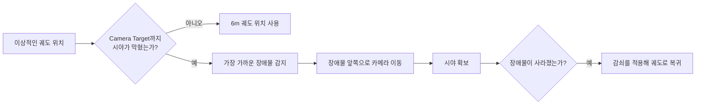

# Cinemachine 카메라 장애물 가림 처리 계약

이 문서는 OpenSpec 작업 2.4에서 구현한 카메라 시야 가림 감지, 장애물 앞쪽 이동, 장애물 해제 후 궤도 거리 복귀와 대표 검증 장면을 설명한다.

## 사용자 관점의 완료 조건

플레이어와 카메라 사이에 벽이나 기둥이 들어오면 화면이 벽으로 채워지기 전에 카메라가 플레이어 쪽으로 이동해야 한다. 장애물이 사라지면 설정된 6m 궤도를 향해 다시 멀어져야 한다.



## 구현 선택

### CinemachineDeoccluder를 선택한 이유

`CinemachineDeoccluder`는 LookAt 대상과 카메라 사이를 물리 질의로 검사하고, 시야를 가리는 콜라이더가 있으면 최종 카메라 위치를 보정한다. 현재 요구사항인 “일반적인 월드 장애물에 의한 가림 최소화”와 직접 일치한다.

`CinemachineDecollider`는 카메라가 이미 콜라이더 내부에 들어간 상황에서 바깥으로 밀어내는 역할에 더 가깝다. 이번 샌드박스에서는 Deoccluder의 구면 검사와 Camera Radius만으로 시야 확보 요구사항을 충족하므로 두 확장을 동시에 사용하지 않았다.

### Pull Camera Forward 전략

세 가지 Deoccluder 전략 중 `PullCameraForward`를 사용한다. 이상적인 카메라 위치에서 플레이어 쪽으로 당겨 장애물 앞에 배치하므로 동작이 예측 가능하고, 작은 전투 공간에서 갑자기 옆으로 이동하는 현상을 줄인다.

## 런타임 데이터 흐름

```text
CinemachineOrbitalFollow
    └── 이상적인 구면 궤도 위치 계산
          └── CinemachineDeoccluder
                ├── Camera Target 방향 SphereCast
                ├── 장애물 감지
                ├── Camera Radius만큼 여유 확보
                └── 위치 보정
                      └── CinemachineBrain
                            └── Main Camera 출력
```

Deoccluder가 궤도 반지름 자체를 바꾸는 것은 아니다. 매 프레임 계산된 이상적 위치에 최종 위치 보정을 더한다. 따라서 장애물이 없어지면 보정량이 감소하면서 원래 궤도로 복귀할 수 있다.

## 기본 설정

| 항목 | 값 | 목적 |
|---|---:|---|
| Collide Against | Default Layer | 현재 프로토타입 월드 콜라이더만 검사 |
| Ignore Tag | Player | 플레이어 CharacterController를 장애물로 오인하지 않음 |
| Transparent Layers | None | 현재 샌드박스에는 투명 시야 레이어가 없음 |
| Minimum Distance From Target | 0.3m | 대상 피벗 바로 주변의 미세 충돌 무시 |
| Distance Limit | 0 | 실제 Camera Target 거리 전체를 검사 |
| Minimum Occlusion Time | 0초 | 벽이 들어오면 즉시 대응 |
| Camera Radius | 0.25m | 카메라가 벽 표면에 너무 가까워지는 현상 완화 |
| Strategy | Pull Camera Forward | 장애물 앞쪽으로 직선 이동 |
| Maximum Effort | 4 | 한 번에 처리할 장애물 탐색 상한 |
| Smoothing Time | 0초 | 좁은 샌드박스에서 불필요한 가까운 위치 유지 방지 |
| Return Damping | 0.05 | 장애물 제거 후 빠르지만 연속적인 복귀 |
| Occluded Damping | 0.05 | 가림 발생 시 빠르게 시야 확보 |
| Shot Quality | Off | 단일 가상 카메라에서는 품질 비교가 필요 없음 |

레이어 구성이 확장되면 환경 전용 레이어를 만들고 `Collide Against`를 좁혀야 한다. 공격 판정, 트리거, VFX 콜라이더까지 모두 검사하면 불필요한 물리 비용과 카메라 튐이 생길 수 있다.

## CombatSandbox 대표 가림 장면

`Camera Occlusion Cases` 루트 아래에 다음 세 콜라이더를 둔다.

| 장면 | 위치·형태 | 검증 목적 |
|---|---|---|
| Direct Occlusion Wall | 플레이어 뒤 -Z, 4×3.5×0.5m | 시작 시 넓은 벽이 정면 시야를 완전히 가리는 경우 |
| Side Occlusion Pillar | 플레이어 왼쪽 -X, 0.75×3.5×0.75m | 카메라를 90° 회전했을 때 좁은 기둥이 가리는 경우 |
| Diagonal Occlusion Block | +X/-Z 대각선, 1×3.5×1m | 코너를 돌며 대각선 장애물이 들어오는 경우 |

세 오브젝트는 모두 정적 BoxCollider를 가진다. 기본 장면에서는 Direct Wall이 시작 카메라 경로를 막기 때문에 Play 직후 Deoccluder의 전진 보정을 관찰할 수 있다.

## 자동 구성 절차

기존 메뉴를 다시 실행하면 Deoccluder와 대표 장면도 함께 재생성된다.

```text
Tiny Vanguard > Setup Third Person Camera Sandbox
```

도구는 다음 순서로 안전하게 반복 실행된다.

1. 기존 `Third Person Camera`를 제거해 가상 카메라 중복을 방지한다.
2. Orbital Follow와 Rotation Composer를 구성한다.
3. Deoccluder의 레이어, 태그, 반지름과 감쇠를 설정한다.
4. 기존 `Camera Occlusion Cases`를 제거한다.
5. 벽, 기둥과 대각선 블록을 같은 이름·위치·크기로 재생성한다.
6. 모든 대표 오브젝트에 BoxCollider가 있는지 검사한다.
7. 씬을 저장한다.

Player 샌드박스 전체를 재생성해도 마지막에 카메라 도구가 호출되므로 새 Camera Target과 Deoccluder 참조가 다시 연결된다.

## 자동 검증

### 정면 벽

PlayMode에서 Direct Wall을 활성화한 기본 장면을 불러와 다음을 검사한다.

- `CameraWasDisplaced`가 참이다.
- 실제 Camera Target 거리가 6m 궤도보다 1m 이상 짧다.
- 카메라가 벽의 플레이어 쪽 면보다 앞에 있다.
- Camera Target에서 실제 카메라까지의 선분에 Direct Wall이 남아 있지 않다.

### 측면 기둥

Direct Wall과 Diagonal Block을 끄고 수평 궤도 각도를 90°로 설정한다.

- Side Pillar 때문에 Deoccluder 보정이 발생한다.
- 실제 카메라 거리가 이상적인 6m보다 짧아진다.
- 카메라가 기둥의 플레이어 쪽 면으로 이동한다.

### 장애물 제거 후 복귀

가림 상태의 거리와 Deoccluder 보정량을 먼저 기록한 뒤 `Camera Occlusion Cases`를 비활성화한다. 1.2초 후 다음 상대 조건을 검사한다.

- Camera Target 거리가 1m 이상 증가한다.
- Deoccluder 보정량이 1m 이상 감소한다.

고정 시점에 정확히 5.4m 이상이어야 한다는 식의 절대 조건은 사용하지 않는다. 프레임 진행과 감쇠 상태에 따라 중간 위치가 달라질 수 있고, 현재 요구사항은 특정 응답시간이 아니라 궤도로의 복귀이기 때문이다.

최종 전체 결과는 EditMode **19/19**, PlayMode **7/7 passed**이다.

## 수동 확인 시나리오

1. `CombatSandbox`를 열고 Play를 누른다.
2. 시작 위치에서 Direct Wall이 플레이어를 가리지 않고 카메라가 벽 앞쪽으로 당겨지는지 확인한다.
3. 마우스를 좌우로 움직여 벽 모서리를 벗어나면 카메라가 원래 거리로 복귀하는지 확인한다.
4. Side Pillar 방향으로 약 90° 회전해 좁은 기둥에서도 시야가 확보되는지 확인한다.
5. Diagonal Block의 모서리를 천천히 오가며 카메라가 벽 안으로 들어가거나 심하게 튀지 않는지 확인한다.
6. WASD 이동 중에도 카메라 기준 이동 방향과 Deoccluder 보정이 함께 동작하는지 확인한다.

## 조정 순서

| 순서 | 조정값 | 관찰 항목 |
|---:|---|---|
| 1 | Collide Against | 실제 월드만 감지하고 트리거·VFX는 무시하는가 |
| 2 | Camera Radius | 벽 표면 클리핑이 없는 최소값인가 |
| 3 | Damping When Occluded | 플레이어가 가려지기 전에 충분히 빠르게 반응하는가 |
| 4 | Return Damping | 벽을 벗어난 뒤 복귀가 느리거나 튀지 않는가 |
| 5 | Smoothing Time | 복잡한 지형에서 거리 펌핑이 있을 때만 증가시킬 필요가 있는가 |
| 6 | Strategy | 직선 전진으로 해결되지 않는 맵에서 다른 전략이 필요한가 |

## 흔한 오류

| 증상 | 원인 후보 | 조치 |
|---|---|---|
| 벽을 그대로 통과해 화면이 막힘 | 벽에 Collider가 없거나 레이어 마스크에서 제외됨 | Collider와 Collide Against 확인 |
| 카메라가 플레이어 몸에 반응함 | Player 태그 또는 Ignore Tag 불일치 | Player 루트 태그와 Deoccluder 설정 확인 |
| 벽을 벗어나도 너무 오래 가까이 있음 | Return Damping 또는 Smoothing Time이 큼 | 한 항목씩 낮추고 복귀 시간 측정 |
| 카메라가 벽 표면을 비춤 | Camera Radius가 너무 작음 | 작은 단계로 Radius 증가 |
| 투명 오브젝트 때문에 카메라가 당겨짐 | 투명 레이어가 감지 대상에 포함됨 | Transparent Layers 또는 전용 레이어 사용 |
| 코너에서 좌우로 흔들림 | 여러 해결 경로와 감쇠가 경쟁함 | Pull Forward 기준 확인 후 Smoothing 소폭 적용 |

## 연결

- 3인칭 카메라: [[09_THIRD_PERSON_CAMERA]]
- 개발일지: [[DevLog/2026-07-10_M1-camera-occlusion]]
- 프롬프트: [[PromptLog/2026-07-10_M1_camera_occlusion_v01]]
- OpenSpec: [player-control spec](../openspec/changes/build-action-rpg-vertical-slice/specs/player-control/spec.md)
