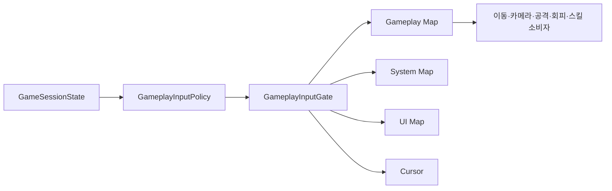

# 게임플레이 입력 차단 계약

이 문서는 OpenSpec 작업 2.5에서 구현한 Playing, Paused, Victory, Defeat 상태별 Input Action Map 활성화 규칙과 커서 정책을 설명한다. 이번 단계는 상태에 따른 입력 차단만 구현하며, 승리·패배 판정과 결과 UI 연결은 OpenSpec 7.2~7.5에서 완성한다.

## 사용자 관점의 완료 조건

- Playing에서는 이동·카메라·공격·회피·스킬 입력이 동작한다.
- Escape를 누르면 Paused로 전환되고 플레이어가 움직이지 않는다.
- Paused에서도 Escape와 UI 입력은 유지된다.
- Victory 또는 Defeat에서는 Gameplay 입력이 모두 꺼지고 Escape로 Playing에 복귀하지 않는다.
- UI 상태에서는 커서가 보이고 잠금이 해제된다.

## 상태별 입력 정책

| 상태 | Gameplay | System | UI | 커서 |
|---|---:|---:|---:|---|
| Playing | 활성 | 활성 | 비활성 | 포커스 시 잠금·숨김 |
| Paused | 비활성 | 활성 | 활성 | 잠금 해제·표시 |
| Victory | 비활성 | 활성 | 활성 | 잠금 해제·표시 |
| Defeat | 비활성 | 활성 | 활성 | 잠금 해제·표시 |

`System/Pause`를 Paused에서도 유지해야 같은 Escape 입력으로 Playing에 복귀할 수 있다. Victory와 Defeat에서는 `TogglePause`가 상태를 바꾸지 않으므로 결과 화면에서 전투로 우회 복귀할 수 없다.

## 단일 소유자 구조

이전에는 `PlayerMovementController`와 `ThirdPersonCameraController`가 각각 Gameplay 맵을 활성화했다. 이 구조에서는 외부 상태 관리자가 Pause로 맵을 꺼도 개별 컴포넌트가 다시 켤 수 있다. 이제 두 컨트롤러는 액션을 읽기만 하고, 맵 활성화와 커서는 `GameplayInputGate` 하나가 관리한다.

## 클래스 책임

| 클래스 | 책임 |
|---|---|
| `GameSessionState` | Playing, Paused, Victory, Defeat 상태 식별 |
| `GameplayInputPolicy` | 상태를 입력 맵 활성화 조합으로 변환하는 순수 C# 규칙 |
| `GameplayInputGate` | Input System 맵 활성화, Pause 콜백, 커서 상태 적용 |
| `GameplayInputGateSandboxTools` | CombatSandbox의 Game Session 루트 생성·검증 |

## 경계 규칙

- 같은 상태를 다시 설정하면 입력 정책은 유지되지만 `StateChanged`를 중복 발생시키지 않는다.
- Playing ↔ Paused만 Pause 토글로 전환한다.
- Victory와 Defeat에서 Pause 입력은 무시한다.
- 컴포넌트가 비활성화되면 세 입력 맵을 모두 끄고 커서를 해제한다.
- 필수 맵이나 `System/Pause`가 없으면 명확한 오류를 출력하고 입력 게이트를 비활성화한다.

## 자동 검증

### EditMode

- 네 상태가 정확한 Gameplay/System/UI 조합으로 변환되는지 검사한다.
- Pause 토글이 Playing과 Paused에서만 상태를 변경하는지 검사한다.
- 전체 EditMode 회귀 결과: **27/27 passed**.

### PlayMode

- Escape 입력 후 Paused가 되고 W 입력으로 플레이어가 이동하지 않는지 검사한다.
- Escape를 다시 누르면 Playing으로 복귀하고 W 입력 이동이 재개되는지 검사한다.
- Victory와 Defeat에서 Escape가 상태를 바꾸지 않는지 검사한다.
- Victory와 Defeat에서 Gameplay 맵의 모든 액션이 비활성인지 검사한다.
- 기존 이동·카메라·가림 처리 회귀를 포함한 전체 결과: **9/9 passed**.

## 수동 확인

1. `CombatSandbox`를 열고 Play를 누른다.
2. WASD와 마우스가 정상 동작하는지 확인한다.
3. Escape를 눌러 Paused로 전환한다.
4. WASD와 마우스가 플레이어와 카메라를 움직이지 않는지 확인한다.
5. 커서가 표시되는지 확인한다.
6. Escape를 다시 눌러 Playing으로 복귀한다.
7. Inspector 또는 테스트 코드에서 Victory·Defeat를 설정했을 때 Gameplay 입력이 유지 차단되는지 확인한다.

## 향후 연결

- OpenSpec 2.6은 Gameplay/Dodge를 소비하지만 맵 활성화 권한은 갖지 않는다.
- OpenSpec 7.2는 실제 세션 전이의 단일 소유자를 확장한다.
- OpenSpec 7.3~7.5는 보스 사망, 플레이어 사망, 결과 UI와 재시작을 `SetState`에 연결한다.

## 연결

- PRD: [[01_PRD]]
- 입력 액션 계약: [[07_INPUT_ACTIONS]]
- 개발일지: [[DevLog/2026-07-11_M1-gameplay-input-gating]]
- 프롬프트: [[PromptLog/2026-07-11_M1_gameplay_input_gating_v01]]
- GUID 오류 기록: [[Troubleshooting/2026-07-11-input-gate-scene-guid-mismatch]]
- 카메라 테스트 기록: [[Troubleshooting/2026-07-11-cinemachine-follow-test-flakiness]]
- OpenSpec: [player-control spec](../openspec/changes/build-action-rpg-vertical-slice/specs/player-control/spec.md)
