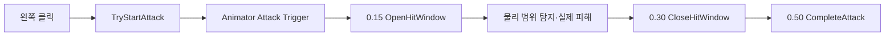

# 기본 공격 애니메이션·활성 판정 창 계약

OpenSpec 3.4에서 구현한 단일 Basic Attack 애니메이션과 데이터 기반 활성 판정 창을 정의한다. 현재 클립은 로직·교육 검증용 임시 애니메이션이며 최종 캐릭터 에셋 통합 시 같은 이벤트 계약을 유지한 채 교체한다.

## MVP 결정

PRD의 “단일 공격 또는 3연속 콤보” 미결정 사항은 현재 범위를 통제하기 위해 단일 Basic Attack으로 결정했다. 콤보는 한 번의 공격 판정·중복 타격 방지·피격 규칙이 안정된 뒤 별도 변경으로 검토한다.

## 시간 계약

| 시점 | Animation Event | 상태 |
|---:|---|---|
| 0.00초 | 공격 시작 | 애니메이션 실행, 판정 비활성 |
| 0.15초 | `OpenHitWindow` | 판정 활성 |
| 0.30초 | `CloseHitWindow` | 판정 비활성 |
| 0.50초 | `CompleteAttack` | 공격 완료·재입력 허용 |

Animation Event 시점은 `BasicAttack.asset`의 Active Start, Active End, Cooldown에서 생성된다. Inspector 정의를 바꾼 뒤 Editor 생성 도구를 다시 실행하면 클립 이벤트도 같은 값으로 갱신된다.

## 런타임 흐름

`PlayerAttackController`는 현재 판정 활성 여부와 공격 순번을 런타임 인스턴스에 저장한다. ScriptableObject에는 이 상태가 저장되지 않는다.

## 임시 시각화

현재 `BasicAttack.anim`은 Player의 `Visual` 캡슐 X·Z 크기를 짧게 확대했다가 되돌린다. 이는 Animation Event가 실제로 재생되는지 확인하기 위한 교육용 표시이며 최종 공격 동작을 의미하지 않는다.

## 상태 경계

- 공격 진행 중 새 공격 입력은 거부한다.
- Paused·Victory·Defeat에서 공격 시작을 거부한다.
- 공격 중 Gameplay 맵이 꺼지면 Idle로 복귀하고 판정 창을 닫는다.
- 판정 시작 전과 종료 후에는 `IsHitWindowActive=false`다.
- OpenSpec 3.5의 실행별 단일 타격 규칙과 3.8의 실제 범위 탐지는 이 활성 창이 열릴 때 실행한다.

## 자동 생성

`Tiny Vanguard > Setup Player Attack Sandbox` 메뉴는 다음을 생성·연결한다.

- `BasicAttack.anim`
- `PlayerCombat.controller`
- Player의 Animator
- PlayerAttackController와 Input Actions·BasicAttack 참조
- 이동을 막지 않는 Trigger 기반 TrainingTarget

## 자동 검증

- Animation Event 이름과 순서
- 이벤트 시점과 AttackDefinition 값 일치
- 실제 왼쪽 클릭 후 0.20초 판정 활성
- 0.40초 판정 비활성, 0.60초 공격 완료
- Pause 시 공격·판정 창 취소와 재시작 거부
- EditMode **45/45 passed**
- PlayMode **13/13 passed**

## 연결

- PRD: [[01_PRD]]
- 전투 정의: [[15_COMBAT_DEFINITIONS]]
- 체력 규칙: [[14_HEALTH_DAMAGE_DEATH]]
- 개발일지: [[DevLog/2026-07-11_M2-attack-animation-window]]
- 프롬프트: [[PromptLog/2026-07-11_M2_attack_animation_window_v01]]
- Unity null 오류: [[Troubleshooting/2026-07-11-unity-object-null-coalescing]]
