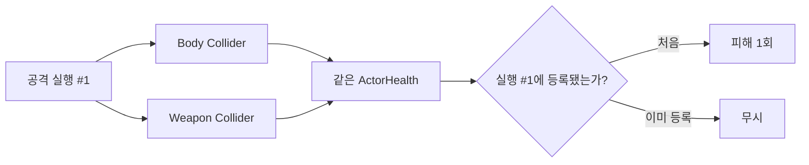

# 공격 실행별 단일 타격 계약

OpenSpec 3.5·3.6에서 구현한 공격 실행 단위 대상 등록, ActorHealth 피해 연결과 다중 Collider 중복 타격 방지 규칙을 정의한다.

## 핵심 규칙

- 공격을 시작할 때마다 새 `AttackExecution`을 생성한다.
- 한 실행은 등록된 피해 대상 인스턴스 집합을 소유한다.
- 같은 대상의 둘 이상의 Collider가 감지되어도 첫 등록만 성공한다.
- 새 공격 실행은 같은 대상을 다시 한 번 타격할 수 있다.
- Collider가 아니라 부모의 `ActorHealth`를 피해 대상 정체성으로 사용한다.

## 구성 요소

| 구성 요소 | 책임 |
|---|---|
| `AttackExecution` | 공격 순번과 등록 대상 집합 소유 |
| `ActorHealth` | ActorDefinition으로 HealthState 생성, 무적 상태를 피해 규칙에 전달 |
| `AttackHitResolver` | Collider에서 부모 ActorHealth를 찾고 실행당 한 번만 피해 적용 |
| `PlayerAttackController` | 공격 시작마다 새 AttackExecution 생성 |

## 피해 시도 등록 시점

대상은 실제 피해 호출 전에 실행 집합에 등록한다. 무적 등으로 피해가 거부되더라도 같은 공격 실행이 판정 창 안에서 반복 호출되어 무적 종료 직후 뒤늦게 피해를 주는 현상을 막는다.

## 자동 검증

- 같은 객체를 한 실행에 두 번 등록하면 두 번째는 false
- 새 실행에서는 같은 객체 등록 성공
- 부모 ActorHealth 아래 두 BoxCollider가 한 실행에서 피해 1회
- 체력 100 → 첫 실행 85 → 두 번째 실행 70
- EditMode **47/47 passed**
- PlayMode **14/14 passed**

## 다음 연결

OpenSpec 3.7은 ActorHealth의 체력 변화·사망 이벤트를 Hit 반응, Death 전이와 데미지 숫자 출력 이벤트에 연결했다. OpenSpec 3.8은 활성 판정 창에서 실제 Player 범위 탐지와 `AttackHitResolver`를 실행하도록 완성했다.

## 연결

- PRD: [[01_PRD]]
- 공격 판정 창: [[16_ATTACK_ANIMATION_WINDOW]]
- 체력 규칙: [[14_HEALTH_DAMAGE_DEATH]]
- 개발일지: [[DevLog/2026-07-11_M2-attack-execution]]
- 프롬프트: [[PromptLog/2026-07-11_M2_attack_execution_v01]]
