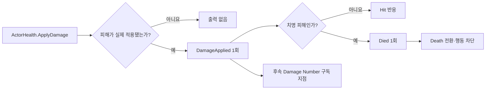

# 피격·사망·피해 출력 이벤트 계약

OpenSpec 3.7에서 실제 피해 결과를 Unity 피격 반응, 사망 전환과 후속 데미지 숫자 UI가 소비할 수 있는 이벤트로 연결했다.

## 이벤트 흐름

## 구성 요소

| 구성 요소 | 책임 |
|---|---|
| `DamageAppliedEvent` | 대상, 실제 피해량, 결과, 월드 위치와 치명 여부 전달 |
| `ActorHealth` | 실제 적용 피해만 `DamageApplied`, 최초 사망만 `Died` 출력 |
| `ActorReactionController` | 비치명 피해의 Hit 반응과 최초 사망의 Death 전환 실행 |
| `PlayerAttackController` | 자신의 ActorHealth가 사망하면 진행 중 공격 취소, 새 공격 거부 |

## 출력 규칙

- 0 이하 피해, 무적 피해와 사망 후 피해는 이벤트를 출력하지 않는다.
- 한 액터의 다중 Collider가 한 공격에 겹쳐도 `DamageApplied`는 한 번만 출력된다.
- 치명 피해는 피해 출력 후 사망 이벤트를 출력하며 일반 Hit 반응을 중복 실행하지 않는다.
- 사망 전환은 한 번만 발생하고 지정된 행동 `Behaviour`를 비활성화한다.
- 구독은 `OnEnable`, 해제는 `OnDisable`에서 대칭으로 처리한다.

## 데미지 숫자와의 경계

이번 단계는 화면 숫자를 직접 생성하지 않고 출력 계약을 제공한다. OpenSpec 6.5의 월드 공간 데미지 숫자는 `DamageAppliedEvent.Amount`와 `WorldPosition`을 구독해 한 번 생성하고 수명 종료 뒤 제거한다. 이 분리로 전투 규칙이 UI 프리팹에 의존하지 않는다.

## 자동 검증

- 비치명 피해: 이벤트 1회, Hit 반응 1회
- 치명 피해: 피해 이벤트 1회, Death 전환 1회, 행동 비활성화
- 사망 후 추가 피해: 피해·사망 이벤트와 전환 추가 발생 없음
- 다중 Collider: 한 공격 실행당 피해 이벤트 1회
- EditMode **47/47 passed**
- PlayMode **15/15 passed**

## 연결

- PRD: [[01_PRD]]
- 체력 규칙: [[14_HEALTH_DAMAGE_DEATH]]
- 공격 실행: [[17_ATTACK_EXECUTION]]
- 개발일지: [[DevLog/2026-07-11_M2-combat-feedback-events]]
- 프롬프트: [[PromptLog/2026-07-11_M2_combat_feedback_events_v01]]
