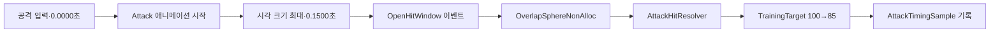

# 공격 애니메이션·피해 타이밍 측정

OpenSpec 3.8에서 Basic Attack의 시각 강조 시점, Animation Event와 실제 체력 감소를 하나의 실행 경로로 연결하고 CombatSandbox에서 시간을 측정했다.

## 실행 경로

## 측정 결과

측정 환경은 Unity 6000.3.11f1의 PlayMode, `CombatSandbox` 단일 공격 실행이다.

| 항목 | 값 |
|---|---:|
| AttackDefinition Active Start | 0.1500초 |
| 공격 시작→실제 피해 적용 | 0.1500초 |
| 절대 오차 | 0.0000초 |
| 피해 적용 대상 | 1개 |
| 훈련 타깃 체력 | 100 → 85 |
| PlayMode 전체 결과 | 15/15 passed |

테스트 결과 출력은 `sequence=1, delay=0.1500s, configured=0.1500s, targets=1`로 기록됐다. 자동 검증 허용 범위는 프레임 스케줄링 차이를 고려해 0.10~0.25초, 설정값 대비 ±0.10초다.

## 구현 판단

- 실제 물리 탐지와 피해 적용은 `OpenHitWindow` Animation Event에서 한 번 실행한다.
- 16개 고정 Collider 버퍼와 `OverlapSphereNonAlloc`을 사용해 공격당 배열 할당을 피한다.
- Player 자신의 ActorHealth는 피해 대상에서 제외한다.
- 훈련 타깃 Collider는 Trigger로 구성해 회피 이동을 막지 않으면서 공격 탐지에는 포함한다.
- `AttackTimingSample`은 공격 순번, 시작·적용 시각, 적용 대상 수를 제공한다.

## 실패 후 수정

첫 구성에서는 훈련 타깃의 일반 Collider가 기존 4m 회피 경로를 막아 PlayMode가 14/15로 실패했다. 타깃을 비차단 Trigger로 전환하고 공격 쿼리에 Trigger를 포함한 뒤 회피 거리와 공격 피해가 함께 통과했다.

자세한 재현과 판단은 [[Troubleshooting/2026-07-11-training-target-trigger-collision]]에 기록한다.

## 연결

- PRD: [[01_PRD]]
- 판정 창: [[16_ATTACK_ANIMATION_WINDOW]]
- 공격 실행: [[17_ATTACK_EXECUTION]]
- 피격 이벤트: [[18_COMBAT_FEEDBACK_EVENTS]]
- 개발일지: [[DevLog/2026-07-11_M2-attack-timing-measurement]]
- 프롬프트: [[PromptLog/2026-07-11_M2_attack_timing_measurement_v01]]
