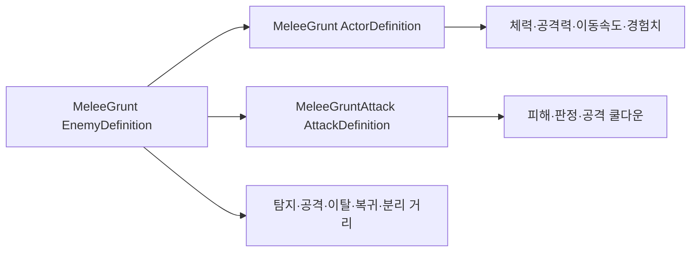

# 일반 적 정의 데이터 계약

OpenSpec 4.1에서 일반 근접 적의 전투 능력치와 AI 거리 조건을 Inspector에서 조정 가능한 정의 에셋으로 구성했다.

## 데이터 조합

`EnemyDefinition`은 기존 Actor·Attack 정의를 참조해 같은 체력·피해 규칙을 재사용한다. 현재 상태, 타깃, 남은 쿨다운과 귀환 위치는 적 인스턴스가 소유한다.

## MeleeGrunt 기본값

| 구분 | 값 |
|---|---:|
| 최대 체력 | 60 |
| 공격력 | 8 |
| 이동속도 | 3.5m/s |
| 경험치 보상 | 25 |
| 기본 피해 | 8 |
| 탐지 거리 | 7.0m |
| 공격 거리 | 1.5m |
| 이탈 거리 | 12.0m |
| 복귀 허용 반경 | 0.25m |
| 공격 쿨다운 | 1.2초 |
| NavMesh 정지 거리 | 1.25m |
| 분리 반경 | 0.75m |

## 불변조건

- 공격 거리 ≤ 탐지 거리 ≤ 이탈 거리
- NavMesh 정지 거리 ≤ 공격 거리
- 공격 쿨다운 ≥ AttackDefinition 쿨다운
- Actor·Attack 참조 필수
- ScriptableObject에 현재 상태·타깃·남은 시간 저장 금지

## 자동 생성과 검증

`Tiny Vanguard > Create Default Combat Definitions`가 다음 에셋을 생성·갱신한다.

- `Data/Actors/MeleeGrunt.asset`
- `Data/Attacks/MeleeGruntAttack.asset`
- `Data/Enemies/MeleeGrunt.asset`

전체 회귀 결과는 EditMode **48/48**, PlayMode **15/15 passed**다.

## 연결

- PRD: [[01_PRD]]
- 기존 전투 정의: [[15_COMBAT_DEFINITIONS]]
- 개발일지: [[DevLog/2026-07-11_M3-enemy-definition]]
- 프롬프트: [[PromptLog/2026-07-11_M3_enemy_definition_v01]]
