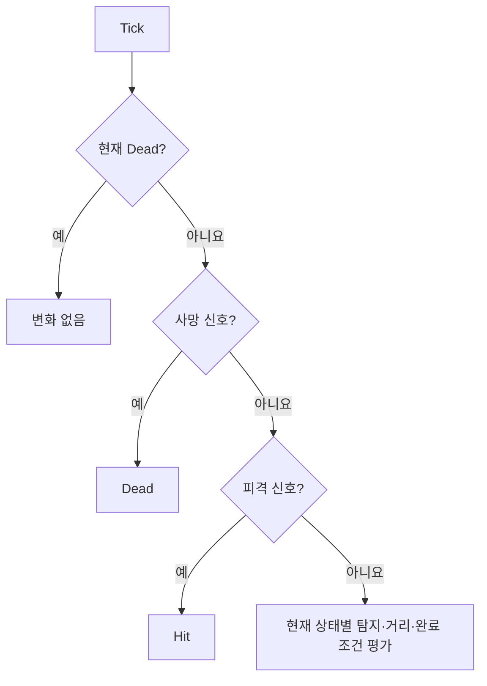

# 일반 적 상태 머신 계약

OpenSpec 4.2에서 일반 적의 여섯 상태와 전이 우선순위를 Unity 오브젝트에 의존하지 않는 순수 C# 규칙으로 구현했다.

## 상태

| 상태 | 의미 | 다음 주요 상태 |
|---|---|---|
| `Idle` | 초기 위치에서 탐지 대기 | Chase, Hit, Dead |
| `Chase` | 살아 있는 타깃 추적 | Attack, Hit, Return, Dead |
| `Attack` | 이동을 멈추고 공격 수행 | Chase, Hit, Return, Dead |
| `Hit` | 피격 경직 중 일반 행동 중단 | Chase, Attack, Return, Dead |
| `Return` | 초기 위치로 복귀 | Idle, Hit, Dead |
| `Dead` | 모든 일반 AI 행동 종료 | 없음 |

## 전이 우선순위

사망은 최우선이자 종단 상태다. 피격은 살아 있는 적의 일반 상태를 중단한다. 같은 상태로의 요청은 전이로 계산하지 않으며 `StateChanged`도 출력하지 않는다.

## 핵심 흐름

- Idle + 살아 있는 타깃 탐지 → Chase
- Chase + 공격 거리·공격 가능 → Attack
- Attack + 공격 완료 → Chase에서 거리·쿨다운 재평가
- 전투 중 이탈 또는 타깃 상실 → Return
- Return + 초기 위치 허용 반경 도달 → Idle
- Hit + 회복 완료 → 조건에 따라 Attack·Chase·Return
- 어느 살아 있는 상태든 사망 → Dead

## 자동 검증

- Idle → Chase → Attack
- 이탈 → Return → Idle
- Chase → Hit, 회복 전 유지, 회복 후 Chase
- Attack 완료 전 유지, 완료 후 Chase
- Attack → Dead 이후 모든 일반 신호 무시
- EditMode **53/53 passed**
- PlayMode **15/15 passed**

## 다음 연결

OpenSpec 4.3은 NavMeshSurface와 Agent를 구성한다. 4.4는 거리·쿨다운·타깃 생존 상태를 `EnemyStateSignals`로 변환하고 현재 상태에 해당하는 이동 또는 공격만 실행한다.

## 연결

- PRD: [[01_PRD]]
- 적 정의: [[20_ENEMY_DEFINITION]]
- 개발일지: [[DevLog/2026-07-11_M3-enemy-state-machine]]
- 프롬프트: [[PromptLog/2026-07-11_M3_enemy_state_machine_v01]]
