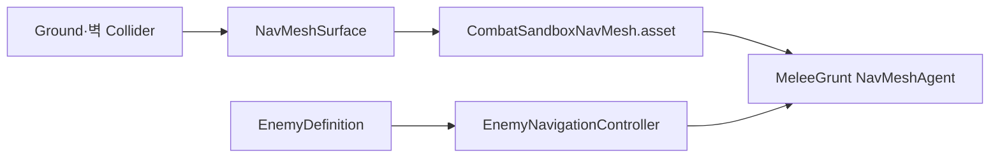

# 적 NavMesh 베이크·이동 계약

OpenSpec 4.3에서 CombatSandbox 지형을 AI Navigation 2.0.11의 `NavMeshSurface`로 베이크하고 MeleeGrunt의 `NavMeshAgent` 이동을 연결했다.

## 구성

## 데이터 연결

| Agent 속성 | EnemyDefinition 원본 | 기본값 |
|---|---|---:|
| Speed | MoveSpeed | 3.5m/s |
| Stopping Distance | NavigationStoppingDistance | 1.25m |
| Radius | SeparationRadius × 0.5 | 0.375m |
| Acceleration | 샌드박스 설정 | 12m/s² |
| Angular Speed | 샌드박스 설정 | 720°/s |

## 런타임 API

- `TryMoveTo(Vector3)`: Agent가 활성·NavMesh 위일 때만 목적지를 설정한다.
- `Stop()`: 현재 경로를 초기화한 뒤 Agent를 정지한다.
- `IsOnNavMesh`: 안전한 이동 호출 가능 여부를 제공한다.

## 자동 구성

`Tiny Vanguard > Setup Enemy Navigation Sandbox`는 다음을 재현 가능하게 생성한다.

- `Navigation` 루트와 `NavMeshSurface`
- `Navigation/CombatSandboxNavMesh.asset`
- `MeleeGrunt` ActorHealth·Reaction·NavMeshAgent·NavigationController
- 이동을 확인할 단순 Capsule Visual

## 자동 검증

- 시작점과 2m 이동 목적지가 NavMesh 위에 존재
- 두 점 사이 `PathComplete`
- Agent 속도·정지 거리가 EnemyDefinition과 일치
- 0.35초 후 0.25m 초과 실제 이동
- 경로 초기화 후 `isStopped=true`
- EditMode **53/53 passed**
- PlayMode **16/16 passed**

## 다음 연결

OpenSpec 4.4는 Player와의 거리를 탐지·공격 신호로 바꾸고 Chase 상태에서 목적지를 갱신하며 Attack 상태에서 Agent를 멈춘다.

## 연결

- PRD: [[01_PRD]]
- 적 정의: [[20_ENEMY_DEFINITION]]
- 상태 머신: [[21_ENEMY_STATE_MACHINE]]
- 문제 해결: [[Troubleshooting/2026-07-11-editor-scene-open-asset-reference]]
- 개발일지: [[DevLog/2026-07-11_M3-enemy-navigation]]
- 프롬프트: [[PromptLog/2026-07-11_M3_enemy_navigation_v01]]
