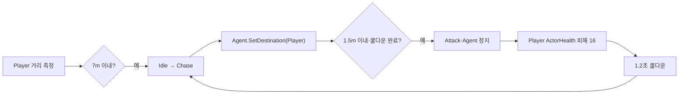

# 적 탐지·추적·공격 쿨다운 계약

OpenSpec 4.4에서 Player 거리와 생존 상태를 순수 상태 머신 입력으로 변환하고 NavMesh 추적·공격·쿨다운 행동을 실제 CombatSandbox에 연결했다.

## 런타임 흐름

## EnemyBrain 책임

- Player 활성·체력으로 살아 있는 타깃 여부 판단
- Idle에서는 DetectionRange 안에서만 최초 탐지
- Chase에서는 Player 위치로 NavMesh 목적지 갱신
- AttackRange와 쿨다운 조건을 동시에 만족하면 Attack 전이
- Attack 진입 시 Agent 정지, 실제 피해 적용, 다음 공격 시각 기록
- Attack 완료 다음 Tick에 Chase로 돌아가 거리·쿨다운 재평가

## 피해 계산

MeleeGrunt 공격 피해는 `AttackDefinition.BaseDamage 8 + ActorDefinition.AttackPower 8 = 16`이다. Player의 ActorHealth는 PlayerMovementController 무적 상태를 전달하므로 회피 무적 중에는 같은 공격이 거부된다.

## 런타임 상태 소유

다음 값은 EnemyBrain 인스턴스가 소유하며 ScriptableObject에 저장하지 않는다.

- 다음 공격 가능 시각
- 공격 실행·적용 횟수
- 현재 상태와 홈 위치
- 현재 Player 참조

## 자동 검증

- 시작 거리 약 5.66m에서 Idle → Chase
- Agent가 Player 방향의 경로를 소유하고 이동
- 1.4m 위치에서 Attack 진입·Agent 정지
- 첫 피해 Player 체력 100 → 84
- 0.25초 후 추가 공격 없음
- 1.2초 쿨다운 후 두 번째 피해 84 → 68
- EditMode **53/53 passed**
- PlayMode **17/17 passed**

## 다음 연결

OpenSpec 4.5는 Player가 홈 기준 이탈 거리 12m를 넘으면 Return으로 전환하고, 홈 0.25m 이내에서 Idle로 복귀시킨다.

## 연결

- PRD: [[01_PRD]]
- 적 상태 머신: [[21_ENEMY_STATE_MACHINE]]
- NavMesh: [[22_ENEMY_NAVIGATION]]
- 개발일지: [[DevLog/2026-07-11_M3-enemy-detection-combat]]
- 프롬프트: [[PromptLog/2026-07-11_M3_enemy_detection_combat_v01]]
