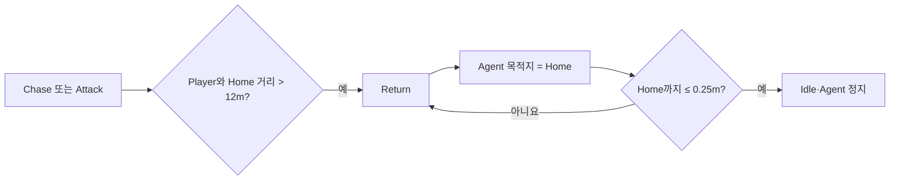

# 적 이탈·홈 복귀 계약

OpenSpec 4.5에서 MeleeGrunt가 생성 위치를 홈으로 기억하고 Player가 전투 허용 범위를 벗어나면 추적을 종료해 홈으로 복귀하도록 연결했다.

## 기준 거리

이탈은 적과 Player의 현재 거리 대신 `HomePosition`과 Player의 거리로 판단한다. 적이 추격하며 이동하더라도 전투 가능 영역이 함께 움직이지 않아 무한 추적을 막는다.

## 내비게이션 규칙

- Chase 정지 거리: 1.25m
- Return 정지 거리: HomeTolerance 0.25m
- Return 중 새 타깃 신호가 있어도 홈에 도달하기 전까지 복귀 유지
- Idle 재진입 후 다음 DetectionRange 탐지를 기다림

## 자동 검증

- 시작 상태 Idle → Chase
- Player를 홈 기준 12m 밖으로 이동하면 Return
- Return 목적지가 홈 허용 반경 안에 설정됨
- Agent Warp로 홈 도착 시 Idle
- 복귀 과정에서 공격 0회
- EditMode **53/53 passed**
- PlayMode **18/18 passed**

NavMesh 목적지는 베이크 격자에 따라 홈에서 0.083m 보정됐으며, 이는 제품 기준 HomeTolerance 0.25m 안이다.

## 연결

- PRD: [[01_PRD]]
- 상태 머신: [[21_ENEMY_STATE_MACHINE]]
- 내비게이션: [[22_ENEMY_NAVIGATION]]
- 탐지·공격: [[23_ENEMY_DETECTION_COMBAT]]
- 개발일지: [[DevLog/2026-07-11_M3-enemy-return-home]]
- 프롬프트: [[PromptLog/2026-07-11_M3_enemy_return_home_v01]]
