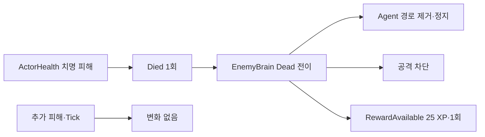

# 적 사망 행동·보상 차단 계약

OpenSpec 4.6에서 MeleeGrunt의 최초 사망을 EnemyBrain이 즉시 처리하고 이후 이동·공격·보상 신호를 차단하도록 연결했다.

## 사망 흐름

## 단일 발생 경계

- `ActorHealth.Died` 자체가 최초 사망에만 출력된다.
- EnemyBrain의 `_deathHandled`가 중복 호출을 한 번 더 방어한다.
- Dead 상태 머신은 종단 상태여서 이후 탐지·피격·공격 신호를 무시한다.
- `RewardAvailable`은 실제 경험치 증가가 아니라 5.4 진행 시스템이 소비할 1회성 보상 신호다.

## 자동 검증

- 치명 피해 직후 Dead
- NavMeshAgent 정지
- 사망 처리 횟수 1
- RewardAvailable 25, 신호 1회
- 사망 후 추가 피해 거부
- 미래 시각 Tick 후 공격 횟수 증가 없음
- EditMode **53/53 passed**
- PlayMode **19/19 passed**

## 연결

- PRD: [[01_PRD]]
- 체력·사망 규칙: [[14_HEALTH_DAMAGE_DEATH]]
- 적 상태 머신: [[21_ENEMY_STATE_MACHINE]]
- 개발일지: [[DevLog/2026-07-11_M3-enemy-death-guard]]
- 프롬프트: [[PromptLog/2026-07-11_M3_enemy_death_guard_v01]]
