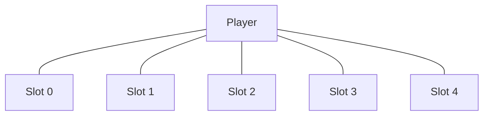

# 다섯 적 접근 슬롯·공간 분리 계약

OpenSpec 4.7에서 여러 근접 적이 Player 중심 한 점에 완전히 겹치지 않도록 고유 접근 슬롯과 NavMeshAgent 회피 반경을 결합했다.

## 접근 슬롯

`EnemyApproachSlots`는 Player 둘레 반지름 1.25m의 원을 적 수만큼 균등 분할한다. 다섯 적의 이론상 인접 슬롯 거리는 약 1.47m다.

## 결합 규칙

- 각 EnemyBrain은 `ApproachSlotIndex`와 전체 슬롯 수를 소유한다.
- Chase 목적지는 Player 위치가 아니라 자신의 슬롯 위치다.
- 다중 접근 시 슬롯 정지 거리는 HomeTolerance 0.25m를 사용한다.
- Agent Radius 0.375m와 High Quality Obstacle Avoidance를 함께 유지한다.
- 기본 단일 전투에서는 추가 네 Brain을 꺼 기존 회귀를 보존한다.
- 집중 검증에서 다섯 Brain을 동시에 활성화한다.

## 자동 검증

| 적 | 이동량 | Player 최종 거리 | 경로 |
|---|---:|---:|---|
| MeleeGrunt | 2.750m | 1.250m | PathComplete |
| MeleeGrunt_02 | 2.750m | 1.250m | PathComplete |
| MeleeGrunt_03 | 2.750m | 1.250m | PathComplete |
| MeleeGrunt_04 | 2.750m | 1.250m | PathComplete |
| MeleeGrunt_05 | 3.030m | 2.250m | PathComplete |

다섯 적의 모든 쌍간 최종 거리가 **0.5m 초과**임을 확인했다. EditMode는 **54/54**, PlayMode는 **20/20 passed**다.

`MeleeGrunt_05`는 장애물을 우회해 다른 적보다 늦게 접근하므로 고정 1.5초 대신 최대 3초 안의 조건 도달 방식으로 검증한다.

## 연결

- PRD: [[01_PRD]]
- 적 정의: [[20_ENEMY_DEFINITION]]
- 내비게이션: [[22_ENEMY_NAVIGATION]]
- 개발일지: [[DevLog/2026-07-11_M3-enemy-spatial-separation]]
- 프롬프트: [[PromptLog/2026-07-11_M3_enemy_spatial_separation_v01]]
